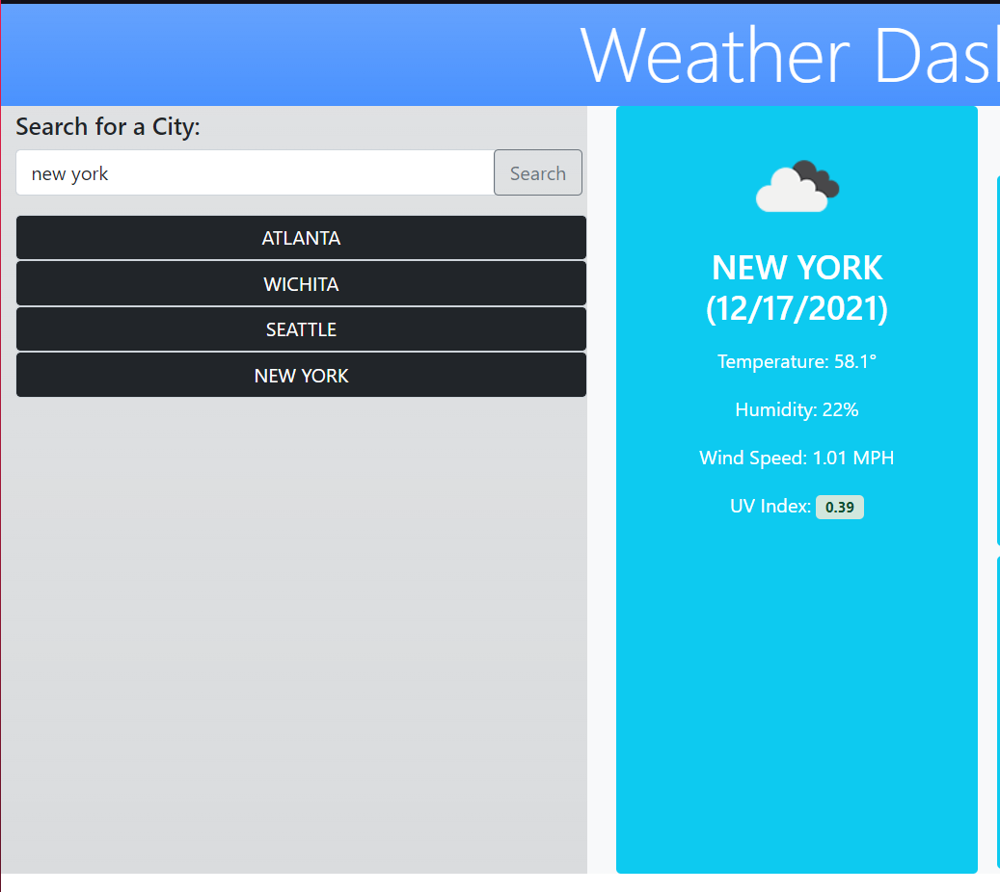

# HW6-Weather-Dashboard

Visit webpage at the following URL:
https://awonka.github.io/HW6-Weather-Dashboard/

## Usage Guide

Once navigated to the Weather Dashboard you will see a field on the left with the text "Search for a City" and an input field below to Enter a City. To check the current weather and 5 day forecast for a city, type the city you wish to see in that input field.

Once you search a city you will see all of the data from current weather and the next 5 day forecast.

You can continue searching for more cities as you like. You will notice a list is forming on the left side of the screen with the city names you have searched before.

You may click on any one of these logged searches to immediately see the current and 5 day forecast for that city again.

Keep in mind it is setup to clear localStorage once you have more than 14 cities listed. This is to keep the list from overflowing the page.

The list and localStorage is now blank.

