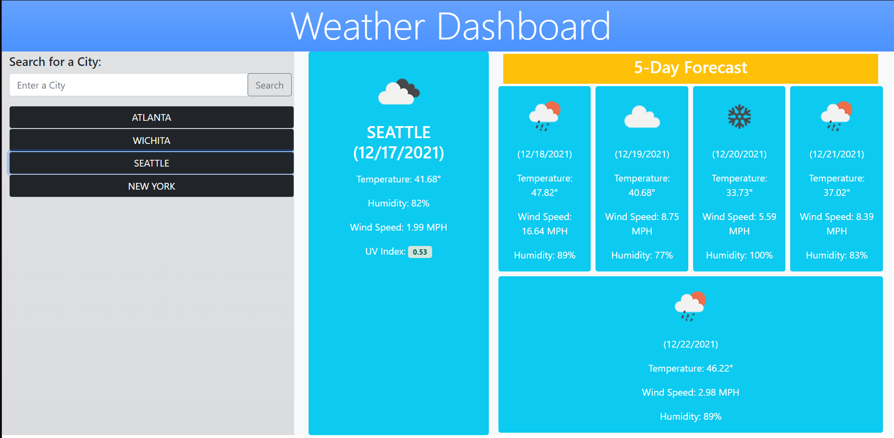

# HW6-Weather-Dashboard

Visit webpage at the following URL:
https://awonka.github.io/HW6-Weather-Dashboard/

## Usage Guide

Once navigated to the Weather Dashboard webpage you will be greeted with a mostly blank page and a search field in the top left. 

To use this page you must enter a city into the "Enter a City" input field and click the search button on the right.

Once you search a city you will be presented with the current forecast for that city to the right of the search field. Below that you will see the next 5 day forecast for the city as well. UV Index will be colored green for when it's favorable, yellow when it's moderate, and red for when it's severe.

You should also notice below the search field and "Clear History" button that the city name is logged. Search more cities and more will be logged here. If you would like to see forecast data for that city again, all you need to do is click on that logged city.

If you want to clear the list of logged cities, all you need to do is click the "Clear History" button.